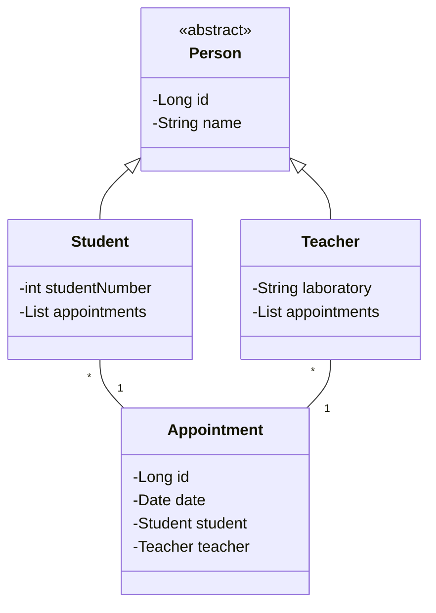

# spring_boot_tp
### Florian Alphonzair - ILA

Ce repository contient une implémentation du projet de TAA avec Spring Boot, contenant des DAO, des DTO. Mapstruct est
utilisé pour faire le lien entre entité et DTO. Un exemple très basique de programmation orientée aspect est implémenté
sur un contrôle de performance d'un endpoint. Finalement, deux endpoints sont sécurisés avec KeyCloak et 
SpringBootSecurity avec un utilisateur ADMIN et un utilisateur USER.

La partie JPA se situe sur cet autre repository : https://github.com/descente-ascii/tpjpa2023

## Architecture du domaine

## Installation et lancement
Le SDK utilisé est openjdk-19 (java version 19.0.2).
Seulement Docker est nécessaire pour le lancement du container KeyCloak pour utiliser les endpoints sécurisés.
Toutes les autres dépendances sont contenues dans le fichier pom.xml et ne nécessitent pas de téléchargement externes.

Je n'ai pas créé de JAR pour ce projet, pour le lancer il suffit de lancer le main de **com.taa.app.ApplicationTP3**.
Le back est relié au serveur HSQL contenu à la racine du projet (mvnw pour Linux et run-hsqldb-server.bat pour Windows)

Le serveur écoute sur le **port 8082**. KeyCloak écoute sur le **port 8080**.

## Requêtes HTTP (Insomnia)
Pour faciliter vos tests, vous pouvez importer le fichier XXX situé à la racine dans Insomnia. Il contient un
ensemble de requêtes HTTP couvrant l'ensemble des fonctionnalités de cette API.

## DTO
Le DTO du Student permet simplement de manipuler un Student contenant seulement son nom et son numéro étudiant.
Le DTO du Teacher permet lui de manipuler un Teacher contenant seulement son nom et son laboratoire de recherche.
Et enfin celui de Appointmement permet de manipuler un Appointment contenant sa date et les id du Student et du Teacher.
Avec **Mapstruct**, j'ai pu ensuite lier les DTO aux entités concernées.

## AOP
Pour implémenter l'aspect, j'ai suivi l'exemple suivant : 
https://gayerie.dev/docs/spring/spring/aop.html#la-programmation-orientee-aspect-pour-gerer-les-annotations

En résumé, cet aspect permet d'avertir (dans la console) quand une fonction met plus de 5 ms à s'exécuter.
Pour cela, je créé une annotation **@Supervision** qui contient un paramètre de type int qui sera la limite de temps
à partir de laquelle le greffon se déclenche. On place cette annotation sur les controllers que l'on souhaite.
Ici, je l'ai mis sur le controller createTeacherTooLong (il fait exactement la même chose que createTeacher mais pour
l'exemple j'ai préféré faire un nouveau endpoint). Enfin dans la classe **aop.SupervisionAspect**, on retrouve la logique du
greffon précédé de l'annotation **@Around** qui permet d'exécuter le code avant et après un point de jonction.

## Authenfication avec KeyCloak

Pour implémenter KeyCloak, j'ai suivi le tutoriel de TAA. Par conséquent je n'ai que deux rôles ADMIN et USER dans mon
client. Je n'ai sécurisé que deux endpoints : updateStudent pour USER et updateTeacher pour ADMIN. Le reste est
accessible à tout le monde.

Les commandes pour lancer le container ou bien générer le token sont les mêmes que sur le tuto de TAA
(cf.https://hackmd.diverse-team.fr/s/ByjU4Olbo)